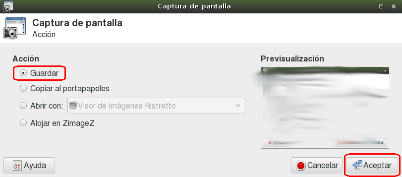

# Informes

1. [Aspectos generales](#aspectos-generales)
2. [Entregar fichero](#entregar-fichero)
3. [Entregar URL](#entregar-url)
4. [Imágenes](#imagenes)

## 1. Aspectos generales

**OJO** en la elaboración de los informes, es muy importante:
* Usar un lenguaje apropiado. No cometer faltas de ortografía. Usar el lenguaje escrito (de los informes) y hablado (de los vídeos)
de forma correcta y apropiada.
* No repetir en la entrega del informe lo mismo que pone el enunciado.
* El documento debe tener una estructura clara y contener las imágenes justas y necesarias. Usar el color rojo de forma esporádica, y sólo para resaltar o destacar algún punto/apartado/texto del contenido.
* Es obligatorio hacer la entrega de cada actividad en el plazo previsto.
* En el caso de los trabajos en grupo:
    * En el trabajo deben aparecer los nombres de los componentes del grupo de trabajo.
    * Todos los componentes del grupo deben hacer la entrega (aunque sea repetida) al profesor.
* Para los nombres de los archivos:
    * Siempre en minúsculas.
    * NO uses espacios, ni tildes, ni eñes, etc.
    * Si necesitas separar palabras usa guiones `-` o `_`.

# 2. Entregar fichero

¿Cómo entregar un INFORME?

Cuando el trabajo se pida entregar con un informe, éste deberá realizarse obligatoriamente en un formato que podemos ver/consultar en cualquier plataforma sin restricciones técnicas y/o legales.

Por ejemplo podremos usar los formatos PDF, ODT, HTML. Si queremos usar otro formato, es posible siempre que se cumpla el criterio anterior.

Además se proporciona una plantilla en la propia plataforma Moodle que servirá de modelo base para la confección de dicho informe. No es obligatorio usar dicha plantilla, pero recordar que debemos poner:
* Encabezados y pies de página
* Portada con título del trabajo, nombres de los componentes del grupo al inicio.
* Una página de índice cuando el informe supere las 5 páginas.
* TODOS los componentes del grupo deben entregar el trabajo, aunque sea el mismo.

En algunas ocasiones tendremos que comprimir la entrega. En estos casos también debemos tener cuidado y elegir un formato de compresión que se ajuste al criterio de formato libre y multiplataforma. Por ejemplo: ZIP, 7Z.

* Entregar informe en algún formato abierto y multiplataforma, como por ejemplo: odt, pdf, etc.
* En el caso de comprimir el archivo usar formatos abiertos y multiplataforma, como por ejemplo: zip, 7z, etc.

# 3. Entregar URL

Cuando la entrega se realiza mediante un URL a un fichero en formato Markdown alojado en un repositorio Git hay que tener en cuenta:
* Se debe entregar URL al fichero Markdown y una referencia al commit.
* Se tendrán en cuenta los aspectos generales a la hora de realizar cualquier informe.
* TODOS los componentes del grupo deben entregar el trabajo, aunque sea el mismo.

# 4. Imágenes

* Las imágenes deben ser claras y adecuadas al contenido que se quiere mostrar. Si el fondo del informe y el de las imágenes son blancos, se van a mezclar ambos, produciendo confusión.
* Tener cuidado de no mostrar las imágenes deformadas.
* Tener cuidado de no mostrar el contenido tan pequeño que cueste leerlo.
* Si la imagen muestra mucha información, se deberá resaltar la parte relevante para facilitar su lectura, Por ejemplo con una marca roja, como por ejemplo: una flecha, un subrayado, un cuadro, etc.
* Usar el recorte de la imagen para no mostrar un exceso de detalle.
* En el caso de que la entrega sea una "secuencia de imágenes":
    * Se debe entregar un fichero comprimido (zip, 7z o tgz) con los
    ficheros de las imágenes con nombres correctamente secuenciados.
    * Los ficheros deben estar ordenados y con nombres como: imagen01, imagen02, etc.

## 4.1 Realizar las Capturas de pantalla

**Captura de pantalla** es un programa que nos permite hacer una *foto* de
la pantalla, y grabarla en un fichero. Esta imagen la podemos
usar, por ejemplo, para incluirla en un informe y demostrar cómo se hace
alguna tarea.

Es muy útil para crear nuestros apuntes, y/o para los trabajos que nos
entregan nuestros alumnos.

## 4.2 Funcionamiento

El programa es muy sencillo de usar, y funciona en 3 pasos:

1. Iniciamos el programa para capturar la pantalla.
1. Seleccionamos el área de pantalla que queremos capturar.
1. Guardamos la imagen con el nombre que elijamos.

## 4.3 Ejemplo

Veamos unas imágenes de ejemplo.
* Seleccionamos el área a capturar

* Guardamos el resultado en un fichero.

> Otro capturador de pantalla muy fácil de usar es *Shutter*
