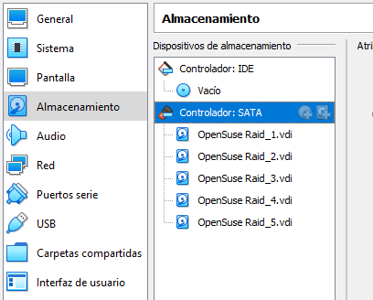
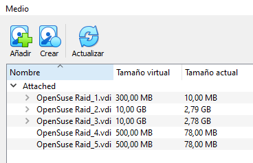
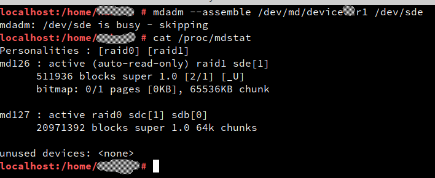
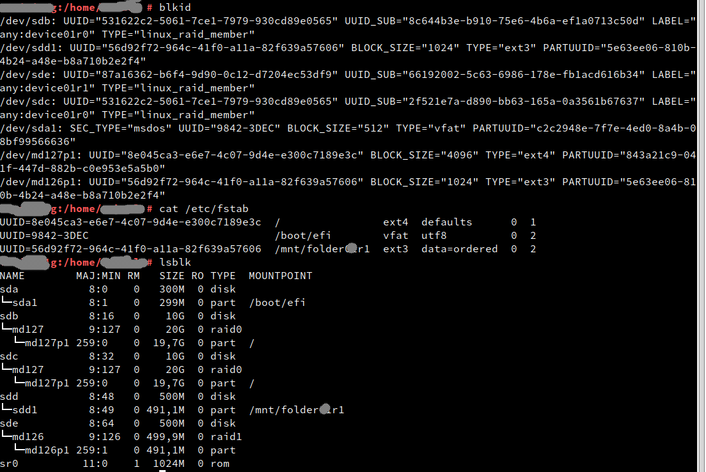

# Problemas con la práctica de RAID

# 1. Al quitar 5 disco la nomenclatura cambia sde->sdd sdd>sde

**Descripción**: El disco que quité fue el SDE, que visto desde la MV, es el disco de la quinta posición, es decir, el último.

Probé los comandos que adjunto en las capturas y sigue dando el mensaje de que el disco está en uso.

Algo que si he notado después de reiniciar varias veces la MV es que, según le dé al sistema, el RAID 1 se configura en el disco SDD una veces y otras en el SDE, dejando el otro disco con el mismo problema de estar en uso y no poder montarlo en el RAID. Es decir, unas veces es el disco SDD el que me da problemas porque no lo puedo añadir al RAID 1 y otras veces es el disco SDE. ¿Qué puedo hacer?








**Profesor:**
Hay varias cosas que hay que ir separando para aclararnos:
1) El hostname de MV está mal. OJO
2) Hay que quitar el disco 5 ...(yo no lo veo quitado)
3) Parece que se te están cambiando los nombres de los discos sde por sdd y al revés. Si sde está busy prueba con sdd. Si te fijas tu última captura de pantalla lo muestra claramente (salida del comando "cat /proc/mdadm").. Recuerden... si no entienden bien lo que hace un comando o la salida que muestra en pantalla no la saben interpretar... NO sigan adelante. Hay que entender antes de seguir. Leelo y si no lo ves pregunta sobre esa imagen. Ahí se ve.
4) Si no queremos evitar que al quitar el 5 disco... vaya saltando de sdd a sde y al revés... yo lo explico. Para eso necesito que me envíes capturas de los siguientes comandos:

```
sudo blkid
cat /etc/fstab
lsblk
```

Con esta información les explico. Gracias por la descripción del problema. Vamos bien!

**Alumno:** El disco 5 no aparece quitado porque en la práctica te pide que lo quites, compruebes que los datos se conservan y por ende, lo vuelvas a colocar. Por eso no aparece quitado, porque yo estoy teniendo problemas para que OpenSuse me lo añada de nuevo al RAID 1, ya que las comprobaciones las tengo hechas. Adjunto captura de los comandos que me pides:



# 2. Problemas para instalar OpenSUSE en RAID0

**Descripción:** Sigo teniendo problemas con la instalación y sigo sin poder instalar, hay veces que se me para en el 97%, otras en el 94%, otras ni si quiera me inicia la instalación de opensuse y hoy me salió un error nuevo.

¿Alguna solución que pueda hacer?, porque llevo ya una semana intentándolo y si vas a dejar la entrega para el martes va a ser imposible que lo tenga. Adjunto imagen del nuevo error que me dio hoy.


**Profesor:** Están pasando los días para entregar la actividad.
Entiendo que pueden haber problemas/dudas y los iremos aclarando. Pero a estas alturas lo problemas/dudas que deben tener es a partir del punto 3...
En caso contrario es que han esperado demasiado tiempo:
1. para empezar la actividad y/o
2. para consultar dudas/problemas.

_Sugerencia_: graba un vídeo con todo el proceso desde el principio hasta llegar al problema. Que se vea grande para no tener que hacer zoom. Usa un editor de vídeos para cortar las partes "aburridas" donde hay que esperar o pones pausa en la grabación. De esta forma tendremos un vídeo donde se ven las decisiones que vas tomando durante el proceso.

El vídeo lo puedes subir por el foro de Moodle porque no debe ser mayor a 49 MiB.

**Alumno:** Entiendo que debamos estar más avanzados del punto 3, pero si no he sido capaz de instalar si quiera el sistema operativo y al no estar presencial en clase para intentar solucionarlo me es imposible avanzar, y no es que haya empezado tarde ni que no haya consultado problemas ya que he posteado en este foro bastante y desde el miércoles pasado.

Adjunto video subido a youtube ya que el video de varios minutos y a buena calidad para no hacer zoom pesa más de 49 MiB. El vídeo está grabado hasta que le doy a instalar, ahí comienza el proceso de instalación y sube hasta el 97% cuando se congela y salta el error que subí antes en la foto. Espero que con este vídeo se vea el error que seguramente estoy cometiendo al crearla. (en esta máquina creo discos VHD en vez de VDI porque a un compañero en clase le funcionó, pero con ninguno de los dos tipos de discos me ha funcionado la instalación)

**Profesor:**
* El hecho de elegir formato VDI o VHD no afecta en este caso.
* En el vídeo me costó ver bien las cosas porque se veía muy chico (me puse las gafas). El proceso está bien hecho! Pero creo que el problema puede venir de que se haya llenado el disco raid0 de 20GiB.
* Prueba a instalar pero ELIGE ESCRITORIO XFCE que es más ligero. Si vuelve a surgir el problema nos conectamos online y lo vemos juntos, pero creo que no va a hacer falta.
* Si repiten la instalación varias veces usando los discos ya creados... recuerden formatearlos porque la segunda vez tiene los discos ocupados con los ficheros de la primera vez.

**Alumno:** Lo he intentado con todos los escritorios y ninguno ha funcionado, esta mañana nos pusimos los compañeros a hacer MV, dieron el fallo, pero la del alumnoX se creó y me la pasó, así que trabajo a partir de esa. Gracias por cambiar la fecha al viernes, me pongo a ello para poder postear mis dudas de los siguientes pasos lo antes posible y tenerlo acabado a tiempo.

**Profesor:** ¿No podría ser la ISO que se hubiera descargado y no estuviera verificada con el SHA512?
(Pensando...)

# 3. Montaje automático del RAID1

**Descripción:** Buenas tardes. Tuve algunos problemas al inicio con la configuración en virtualbox pero pude avanzar correctamente. Ahora me encuentro en la parte de la raid1 y tengo el problema de que al reiniciar la máquina no se me monta automáticamente en /mnt/folderXXr1. Mañana en clase lo intentaré solucionar.

**Profesor:**
* Revisa el fichero /etc/fstab por el terminal o
* También lo puedes revisar por Yast -> particionado. Verificar el punto de montaje de la partición.
* Envía captura de imagen.

**Descripción:** No sé si está montado correctamente pero seguí con la práctica y me encuentro con el problema de que creé las carpetas para ver si se conserva la información con el reinicio y no se me conservó.


**Profesor:**
DUDA:
La información de /etc/fstab
* Lo hiciste por Yast? Entonces envía captura.
* Lo hiciste por comandos? Entonce ¿De dónde has sacado el valor de UUID?

Te dije que me enviaras las salida de estos comandos:
```
sudo blkid
cat /etc/fstab
lsblk
```

Y te olvidaste de uno??? Envía el comando que falta. Por favor!

Haz lo siguiente para salir de dudas:
(1) Pon el disco que falta.
(2) Asegúrate que el raid1 está correcto con los 2 discos
(3) Escribe información en ellos.
(4) Vuelve a quitar el disco sdd.
(5) Y volvemos a comprobar que los datos están.

Si me vuelves a decir que te ha fallado pero no me envías capturas de imagen de los apartados ... estamos en las mismas y te tendré que volver a decir lo mismo. Necesito las imágenes de esos puntos, o hacer un vídeo como hizo Roberto. Como te sea más cómodo. Pero si haces un vídeo... por favor que se vea en grande!

Muchas gracias!
