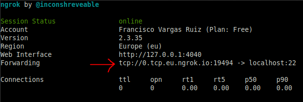
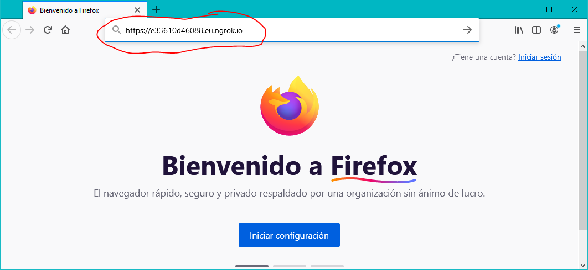

author: fvarrui

# SSH Reverse Tunneling con 'ngrok'

En ocasiones puede ser que necesitemos exponer un servicio local (servidor SSH, Jupyter, RStudio, Web, FTP, ...) con el resto del mundo.

## Problema

El problema que nos encontramos es que nuestra salida a Internet suele ser a través de un router con [NAT](https://es.wikipedia.org/wiki/Traducci%C3%B3n_de_direcciones_de_red), por lo que todos los servicios locales no son accesibles desde el exterior.


## Solución 1: Tenemos el control sobre el router

Si tienes la suerte de tener el control sobre el router, una posible solución sería abrir puertos en el mismo, que consiste en configurar unas reglas en la tabla NAT del router para que redirija el tráfico que llega a un determinado puerto (o rango de puertos) de su interfaz externa a un servidor local (en la red interna).


El inconveniente de esta solución es que cada vez que necesitemos añadir un puerto para un servicio nuevo o cambie la IP de nuestro servidor tenemos que añadir o modificar las reglas.

## Solución 2: Disponemos de un servidor remoto

Si no tuviéramos control sobre el router, pero si dispusiéramos de un servidor remoto con una IP pública, sería posible usar la **redirección de puertos inversa de SSH** (*SSH Remote Port Forwarding* o *Reverse Tunnelling*). Es necesario que el servidor remoto disponga del servicio SSH y que tenga la opción `GatewayPorts yes` habilitada en el fichero de configuración `/etc/ssh/sshd_config`.


Tendríamos entonces que abrir un túnel inverso entre el servidor local y el servidor remoto, lanzando el siguiente comando en el servidor local:

```bash
ssh -R 8888:localhost:8888 193.72.x.x
```

> Este comando redirige todo el tráfico del puerto 8888 de `193.72.x.x` al puerto 8888 de `localhost`.

## Solución 3: ngrok

La solución más rápida y sencilla se llama **ngrok**, que es un servicio que ya nos ofrece la posibilidad de hacer **redirección de puertos inversa de SSH** (*SSH Remote Port Forwarding* o *Reverse Tunnelling*).


1. Debemos [registrarnos en **ngrok**](https://dashboard.ngrok.com/signup).

	

2. Descargamos y extraemos (pues se trata de un fichero ZIP) en el servidor local la versión adecuada a nuestro sistema del comando **ngrok**:

	

3. Localizamos el token de autenticación en el panel de **ngrok** y lo utilizamos en el siguiente comando:

  

  ```bash
  ngrok authtoken <token de autenticación>
  ```

  > Este paso sólo habría que hacerlo una vez en el servidor local.

4. Finalmente, redirigimos el tráfico de **ngrok** al puerto que queramos con el siguiente comando:

   ```bash
   ngrok [http|tcp|tls] puerto -region eu
   ```

   > La opción `-region eu` es para que se utilice un servidor `ngrok` ubicado en Europa.

### Ejemplo 1: exponer un servidor SSH

El siguiente comando redirige todo el tráfico TCP al puerto 22 (SSH) del servidor local:

```bash
ngrok tcp 22 -region eu
```

Tras ejecutar el comando se abriría un túnel inverso SSH que nos permite acceder al puerto `22` del servidor local (`localhost`) a través a la dirección `0.tcp.eu.ngrok.io` en el puerto `19494` (en este caso, pues esto último cambia cada vez).



Ahora podemos acceder al servidor SSH desde Internet:

```bash
$ ssh fran@2.tcp.eu.ngrok.io -p 19850
fran@2.tcp.eu.ngrok.io's password: ********
Last login: Sun Sep 20 21:14:40 2020 from 127.0.0.1
fran@servidor-local:~$ _
```

### Ejemplo 2: exponer un servidor Web

El siguiente comando redirige todo el tráfico HTTP al puerto 80 del servidor local.

```bash
ngrok http 80
```

Tras ejecutar el comando se abriría un túnel inverso SSH que nos permite acceder al puerto `80` del servidor local (`localhost`) a través a la dirección `e33610d46088.eu.ngrok.io`  tanto en el puerto `80` (HTTP) como en el `443` (HTTPS) (al igual que en el ejemplo anterior, estos últimos cambian de una vez a otra).


Si tuviéramos un servidor web en nuestro servidor local podríamos acceder a él desde Internet con un navegador:



## Referencias

* [SSH Tunneling — The black magic for data science](https://hackernoon.com/the-ssh-black-magic-for-data-science-acd6f65e8528).
