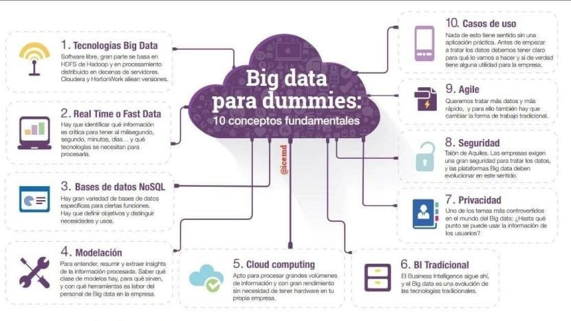

Enlaces de interés:
* https://medium.com/analytics-vidhya/data-analyst-roadmap-e8f9de05f93a
* https://www.youtube.com/watch?v=4QajduKoSWA
* https://www.simplilearn.com/how-to-build-successful-data-analyst-career-article

* [10 herramientas de Big Data imprescindibles para el análisis de datos](https://www.iebschool.com/blog/mejores-herramientas-big-data/)
* [7 Herramientas Big Data para tu empresa - IIC](https://www.iic.uam.es/innovacion/herramientas-big-data-para-empresa/)

# Herramientas de visualización de datos

QlikView, QlikSense, Tableau, Power BI, Domo,
Pentaho, MicroStrategy, Business Objects, RJMetrics, Klipfolio, entre otras.

– Tendencias de visualización de datos.

# How to Become a Data Analyst: Tasks Performed by Data Analysts

    Gathering and extracting numerical data.
    Finding trends, patterns, and algorithms within the data.
    Interpreting the numbers.
    Analyzing market research.
    Applying these decisions back to the business.

To be a successful data analyst, you need to have a passion for numbers,
the ability to extract useful insights from processed data, and the skill
to present these insights in the visual form accurately. These skills cannot be learned overnight.
 With patience, hard work, and the right guidance, anything is possible. And yes, it all begins with a plan.

What Kind of Data Analyst Job Can You Get?

To the surprise of no one, data analysts require proficiency in data analytics.
 But once you get into data analytics, you are suddenly eligible for many different kinds
of data analyst-related jobs. Here is a partial list:

    Business Intelligence Analyst
    Data Analyst
    Data Scientist
    Data Engineer
    Quantitative Analyst
    Data Analytics Consultant
    Operations Analyst
    Marketing Analyst
    Project Manager
    IT Systems Analyst

Profile photo for Maithri
Maithri
, Business Analyst Intern at Briisk (2021-present)
Answered 6 months ago

I recently had a conversation with a data analyst who works at PayPal
and he helped me understand the path to data analytics which was pretty useful to me.

I’m going to consolidate my conversation with him into 8 steps.

| Herramienta                     | Descripción |
| ------------------------------- | ----------- |
| Programming Language **(Python/R)** | Python and R are the most widely used programming language. A grasp of one of these languages will help you understand how to clean, manipulate and analyze data. |
| **Business Analytics using R** | Get your hands dirty. Check out Kaggle. They have tons of datasets and codes from other people who’ve analyzed the data. Pick a dataset you enjoy, analyze and make some observations. Lastly, check out what other people have done with the same dataset. |
| SQL - to extract data | Be thorough with CRUD. Practice a few questions on Hackerrank (or similar websites!) |
| **Excel** | I’m sure excel is familiar to most people. Take some time out and figure out what you do not know and try to learn them. Practice the basic functionalities required to build reports. |
| Visualization Tools | After you’ve analyzed the data, you need to visualize it. There are lots of tools. Play around, pick one tool, and learn it. My suggestion is **Tableau**.|
| Statistics | A basic understanding of statistics is extremely important. Make sure you know the following concepts|

        Descriptive Method and Inferential Method
        Mean, Variance, Standard deviation
        Measures of Central tendency (Mean, Median, Mode)
        Percentiles of Data distribution (First Quartile, Second Quartile, Third Quartile)
        Dispersion of data, Bell curve
        Hypothesis Testing
        Chi-Square Test

    Soft Skills - Communication skills are crucial to explaining your findings. Creative thinking is required to find details that other people might miss or ignore. No machine can replace the way you think, interpret and communicate. It is unique for each person!

    Models/Algorithms - After a good grasp of the above steps, move onto learning some basic models and algorithms that interest you.

    Business - Now, you have to decide what to analyze! You now have the skills and there are tons of industries where data analytics are required considering the amount of data generated every second. Figure out what you like, build your niche!

=================================
https://blog.desdelinux.net/big-data-software-libre-codigo-abierto-aplicaciones-disponibles/
